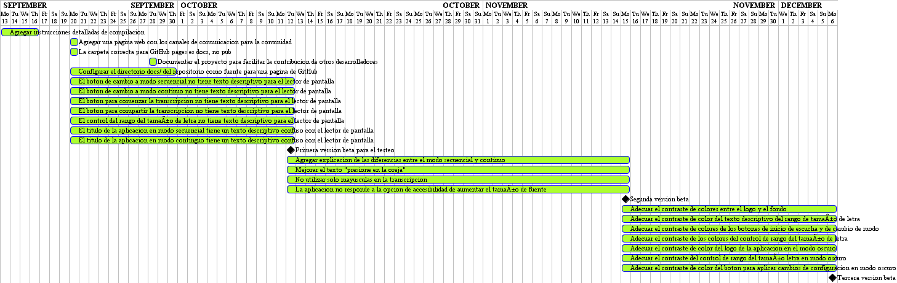

# Tescucho: mapa de ruta

En nuestro repositorio es posible encontrar [el tablero del mapa de ruta para la aplicación Tescucho](https://github.com/CISTAS/Tescucho2.0/projects/1) para Android. Hacer público nuestra planificación nos permite mantener a la Comunidad Tescucho al tanto de los cambios de funcionalidad solicitados en nuestro [sistema de manejo de incidentes](https://github.com/CISTAS/Tescucho2.0/issues) que han entrado desarrollo. A la vez, sirve para focalizar el esfuerzo de los programadores que colaboran con el proyecto, a quienes también se les brinda [documentación](https://cistas.github.io/Tescucho2.0/devel.html) de apoyo. 

## Guía al tablero

Cada [tarjeta](https://es.wikipedia.org/wiki/Software_de_administraci%C3%B3n_de_proyectos) de muestro tablero se corresponde con algún incidente registrado en el sistema:

- En la columna **En progreso** se incluyen todas las tareas planificadas para la actual fase de desarrollo y que ya están iniciadas. 

- En la columna **Para hacer** están incluidas todas las tareas pendientes y asignadas a futuras fases en el desarrollo.

- La columna **Hecho** alberga todas las tareas que han sido realilzadas en las anteriores fases del desarrollo.

## Guía de etiquetas

Cada tarea responde a un incidente [etiquetado](https://github.com/CISTAS/Tescucho2.0/labels) según el aspecto del proyecto al cual se vincula. A continuación listamos sus descripciones: 

- **documentation:** relacionada a la documentación del proyecto.
- **interface:** relacionada a la interfaz gráfica de usuario.
- **implementation:** relacionada a la implementación del código.

## Hitos o fases

La presente etapa de desarro incluye varios [hitos](https://github.com/CISTAS/Tescucho2.0/milestones) o fase que listamos a continuación:

- <u>_Primera versión beta para el testeo_</u>: Publicación en canal a determinar de la primera versión beta de la presente etapa de desarrollo, para ser verificada por los colaboradores de la Comunidad Tescucho.

  El objetivo de la misma será incluir la mayor cantidad posible de mejoras referidas a la navegación por voz (_screen reader_) de la aplicación. **[Finaliza: Octubre 12 de 2021]**

- <u>_Segunda versión beta_</u>: Entrega, en canal a determinar, de la segunda versión beta de la aplicación para su verificación por los integrantes de la Comunidad Tescucho.

  La misma incluirá la mayor cantidad de mejoras relacionadas con la accesibilidad de la interfaz y su usabilidad: diseño adaptable y consejos de uso. **[Finaliza: Noviembre 15 de 2021]**

- <u>_Tercera versión beta_</u>: Tercera y última versión beta de esta etapa del desarrollo para su verificación por los colaboradores de la Comunidad Tescucho.

  La misma incluirá la mejoras de accesibilidad a las gráficas y colores de la aplicación. **[Finaliza: Diciembre 6 de 2021]**

- <u>_Nueva versión 2.1 de la Aplicación Tescucho_</u>: Nueva versión 2.1 de la aplicación publicada en la [Play Store](https://play.google.com/store/apps/details?id=appinventor.ai_andres_piegari.TeEscuchoDCH6j), la misma incluirá todas las mejoras asignadas hasta esta etapa más los informes de errores producto de este desarrollo.

  Se elaborará un nuevo mapa de ruta de la aplicación a partir de lo aprendido por la Comunidad Tescucho. **[Finaliza: Diciembre 27 de 2021]**

## Diagrama de Gantt 

Dentro de las técnicas de la administración y planificación de proyectos es común recurrir al apoyo visual de [diagramas de Gantt](https://es.wikipedia.org/wiki/Diagrama_de_Gantt). Nuestro actual mapa de ruta puede ser así descripto por la siguiente figura:

